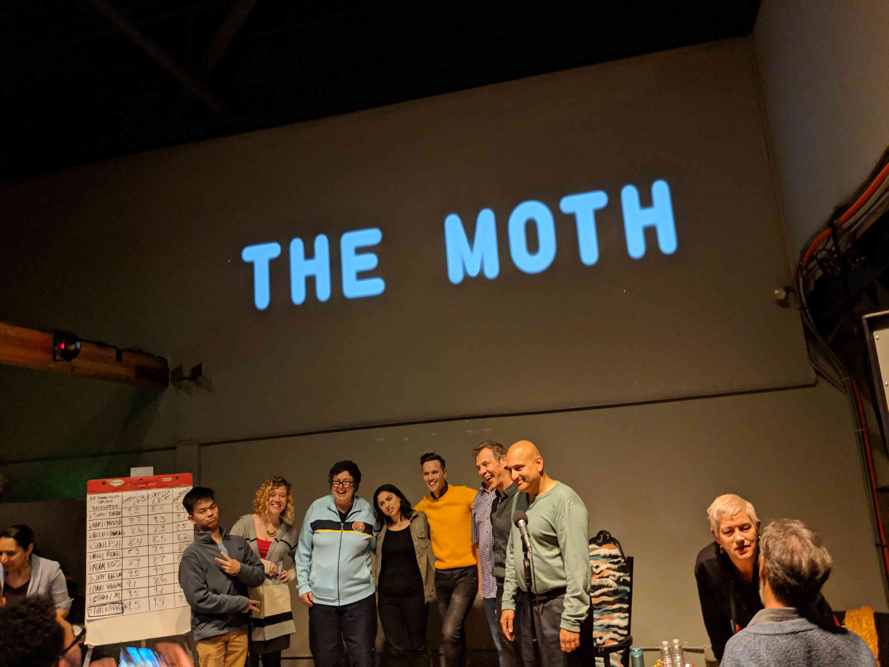

Brittany had the great idea of getting Joey and Lindsey tickets to
[The Moth](https://themoth.org/) for Christmas. So we went today and got some
great Red Hen Chili from Kevin & Gail's
[Chili Palace](http://www.chilipalace.net/) before the show. Between us we also
got some accompanying hot dogs and cornbread. It was great, some very tasty
chili.

The Moth itself was a neat collection of stories from people with various
backgrounds. The theme was "Backwards" and everyone shared stories, ranging
from dealing with death to learning how to drive at an age most would consider
too young. Overall, another great Try it Out Tuesday!

