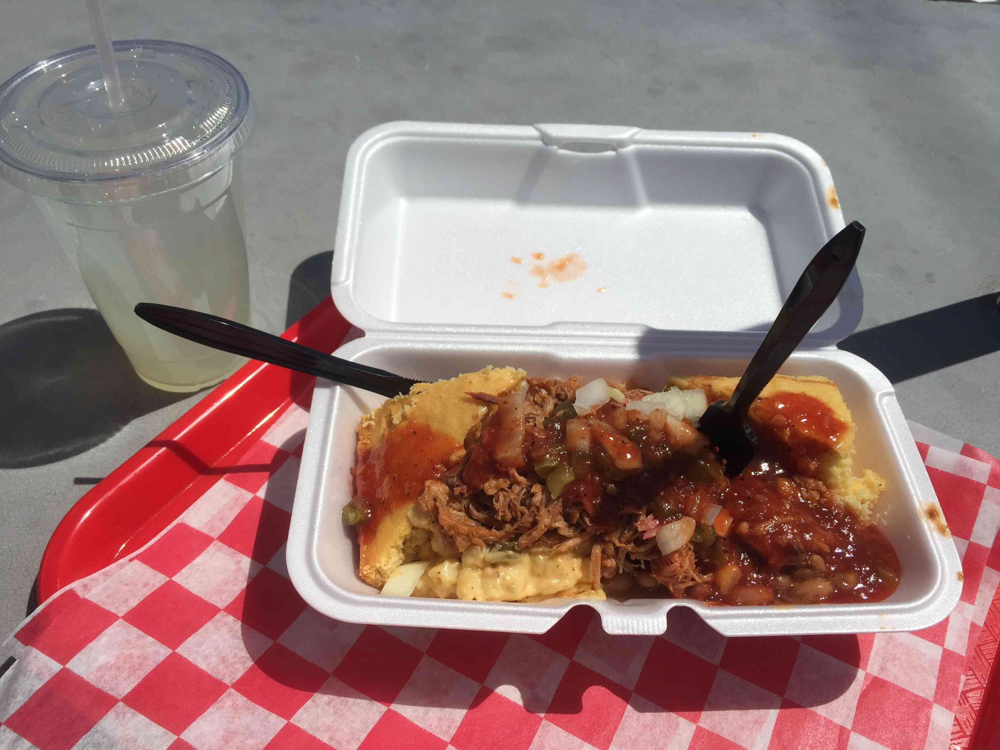

## Joey @ Alamo BBQ

There's a lot to like about Richmond, but Alamo BBQ is at the top of my list.
Why? It checks all the boxes, from friendly people and historic location to
kick-ass food. I ordered the Texas Trainwreck—an Alamo signature—and enjoyed
every bite. As an added bonus, I washed it down with a homemade limeade.

Check out the [menu](http://alamobbq.com/menu.html).

Get the full story on our podcast below.

<iframe width="100%" height="166" scrolling="no" frameborder="no"
allow="autoplay"
src="https://w.soundcloud.com/player/?url=https%3A//api.soundcloud.com/tracks/614490060&color=%23ff5500&auto_play=false&hide_related=false&show_comments=true&show_user=true&show_reposts=false&show_teaser=true"></iframe>

## Mike @ Zazang Korean Noodles

No podcast from me folks, but super speedy service and a good time enjoying
some blackbean sauce over noodles along with some fried pot stickers with Ben.
